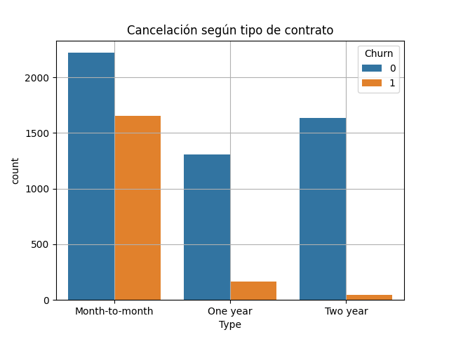

# Proyecto final del bottcamp Data Scientist
## Nombre del proyecto: TELECOM 🛰️

Al operador de telecomunicaciones Interconnect le gustaría poder pronosticar su tasa de cancelación de clientes. Si se descubre que un usuario o usuaria planea irse, se le ofrecerán códigos 
promocionales y opciones de planes especiales. El equipo de marketing de Interconnect ha recopilado algunos de los datos personales de sus clientes, incluyendo información sobre sus planes y contratos.

# Estructura del proyecto ⛓️
- **data:** Se encuentran todos los archivos o dataframes que utilizamos para el proyecto, todos estan en formato CSV
- **notebooks:** En este apartado se encuentra un notebook que contiene todo el proyecto en un solo archivo sin arquitectura
- **src:** En esta carpeta se encuentran los diferentes archivos ya con arquitectura, el archivo principal es el de "pipeline.py" desde ahi se manda a llamar las funciones
- **requirements:** este archivo contiene las librerias que fueron utilizadas en el proyecto

# Exploracion de datos 🌐
En este proyecto, realizamos una Exploración de Datos (EDA) para entender las características de nuestros datasets, identificar patrones y detectar posibles problemas como valores atípicos o datos faltantes.

Contamos con 4 datasets (contratos, info_personal, telefono e internet) todos comparten una columna en comun la de "customerID", cada dataframe contiene informacion de diferentes areas.
Nosotros los unificamos en uno solo para poder realizar la purga de informacion.

Columnas del dataframe unificado:

- **customerID:** Representa el registro unico de cada cliente
- **BeginDate:** Aqui tenemos la fecha de comienzo de su contrato
- **EndDate:** La fecha final de su contrato, si no ha finalizado esta en null
- **Type:** Tipo de contrato que tiene el cliente (MesxMes, un año, dos años)
- **PaperlessBilling:** Si el cliente realiza factura o no
- **PaymentMethod:** El tipo de pago del cliente (pago electrinic, por mail, tranferencia bancaraia automatica, tarjeta de credito automatica)
- **MonthyCharges:** Cargos mensuales
- **TotalCharges:** Total de cargos
- **IntenetService:** Servicio de internet (DSL, Fibra optica)
- **OnlineSecurity:** Bloqueador de sitios web maliciosos (servicio extra)
- **OnlineBackup:** Almacenamiento de archivos en la nube y backup de datos (servicio extra) 
- **DeviceProtection:** Software antivirus (servicio extra)
- **TechSupport:** Una línea de soporte técnico (servicio extra)
- **StreamingTV:** Streaming de TV (servicio extra)
- **StreamingMovies:** Directorio de películas (servicio extra)
- **Gender:** Genero
- **SeniorCitizen:** Adulto mayor
- **Partner:** Compañeros del usuario
- **Dependents:** Personas dependientes del usuario
- **MultipleLines:** El teléfono se puede conectar a varias líneas de manera simultánea

Una vez unificado lo principal fue convertir las columnas en su tipo de dato correspondiente, para proceder a realizar ciertas operaciones.

Excluimos los clientes que tengan su contrato de inicio despues del 1 de febrero del 2020, ya que solo nos basaremos en clientes que hayan sido registrados despues de esa fecha.

Creamos la columna que nos ayudara a identificar que clientes se dieron de baja del servicio y cuales siguen activos aún, esta columna nueva se llamara "Churn" donde:
- **0** => Activo
- **1** => Cancelo el servicio

Como se puede apreciar en la descripcion de las columnas del dataframe se cuenta con distintos servcicios extra, hay clientes que tienen en null todos estos servicios, 
tras hacer un analisis nos percatamos de que esos clientes solo cuentan con el servicio de telefonia por lo tanto esos servicios extra no estan activos, cambiamos el valor null por "No"

La columna "MultipleLines" es la que nos indica si el usuario tiene varias lineas en uno o solo una, pero no indica si un cliente no cuenta con el servicio de telefonia, por lo tanto agregamos 
una nueva descripción "not using" la cual nos indica que no cuenta con servicio de telefonia, al igual en la columna "InternetService" se agrega una nueva opcion "not using" la cual indica que no
tienen servicio de intenet

Una vez realizados estos cambios eliminamos los clientes que no tengan activos servicios de internet y de telefonia.

Creamos una columna nueva "SeniorityMonths" donde nos indica cuantos meses tienen de antiguadad los clientes con el servicio o cuanto tiempo duraron con el servicio, ademas, implementamos otra columna "ContratedServices"
la cual indica cuantos servicios tiene activo el cliente.

# Graficas 📊

Estas son algunas de las graficas que se realizan en el proyecto. 
Podemos apreciar que menos de la mitad de clientes que hay en el dataset han cancelado su servicio, ademas de que la mayor de parte de cancelaciones han sido realizadas por clientes que tienen contratos
de mes x mes a comparacion de los que tienen contrato de 1 o 2 años; Un punto importante es que los clientes que tienden a cancelar el servicio son aquellos que realizan de forma manual su pago a diferencia
de los que cuentan con el servicio de cobro automatico.

**La exploración de datos nos permitió detectar patrones y ajustar el preprocesamiento para mejorar la calidad del modelo.**

# Preprocesamiento 🔄

Para la parte del preprocesamiento vamos a unificar algunas columnas para facilitar el manejo de los datos, ademas de seleccionar un modelo para nuestro entrenamiento.

Creamos una columna "Payment" donde simplicaremos los valores, actualmente tenemos 4 opciones pero dos de ellas son para hacer pagos manuales y los otras dos son opciones para pago automatico,
por lo tanto en esta nueva columna solo pondremos dos opciones "Manual" y "Automatic"

Una vez unificada esa columna procedemos a extraer en un nuevo dataframe las columnas que utilizaremos para el procesamiento del modelo, estas son las columnas que nos quedaremos:

- Type
- PaperlessBilling
- MonthlyCharges
- TotalCharges
- InternetService
- MultipleLines
- Churn
- SeniorityMonths
- ContratedServices
- payment

**Hemos decidido tomar estas columnas porque consideramos que son las que aportan valor al analisis para poder seleccionar que cliente es propenso a dejar de consumir el servicio.**

Una vez filtrado nuestro dataframe comenzamos a identificar las columnas binarias, las cuales contienen dos valores como "Yes" y "No" o "Manual" y "Automatic", a estas columnas unicamente 
cambiaremos los valores por 1 y 0 implementando Label Encoding:

- PaperlessBilling
- payment

Ademas identificamos las columnas que son multiclase (las que tienen mas de dos valores en su columna) para aplicar el metodo One-Hot-Encoding (OHE):

- Type
- InternetService
- MultipleLines

Una vez realizado el proceso anterior tambien hacemos el escalado a las columnas numericas con `StandardScaler()` 

  

